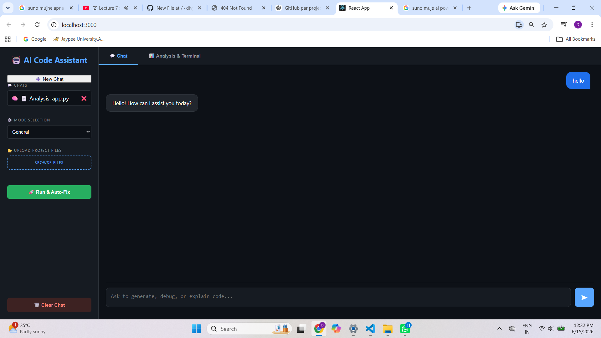
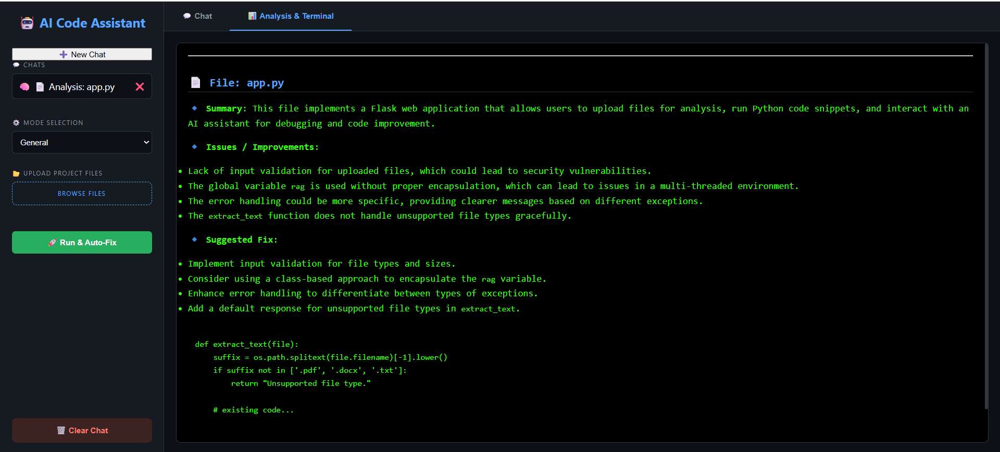

# 🤖 AI Powered Code Assistant

An advanced AI-powered Code Assistant that helps developers write, debug, analyze, and understand code using LLMs, RAG, and sandbox execution.

---

## 📌 Overview

This project is a full-stack AI assistant that acts like a mini ChatGPT for developers.

It can:
- 💻 Generate code from prompts
- 🐛 Debug and fix errors
- 📝 Explain code in simple language
- 📂 Analyze uploaded files (PDF, DOCX, code)
- 🧠 Use RAG (Retrieval-Augmented Generation)
- 🛡️ Run Python code safely in a sandbox
- 💾 Maintain chat history

---

## ✨ Features

- **AI Chat Assistant**: Powered by LangChain and OpenAI API.
- **Code Analysis Engine**: Breaks down complex source code files.
- **Debugging Assistant**: Automatic error detection with smart fix suggestions.
- **RAG Engine**: Upload files (PDF, DOCX, Code) for contextual question answering.
- **Multi-Chat System**: Saves session memory across multiple chats.
- **Python Sandbox**: Executes code safely in an isolated environment.

---

## 🛠️ Tech Stack

**Frontend:**
- React.js, HTML5, CSS3, JavaScript (ES6+)

**Backend:**
- Flask (Python), SQLite (Database)

**AI / ML:**
- OpenAI API, LangChain, ChromaDB (Vector Database)

**Libraries Used:**
- Python-dotenv, PyPDF, docx2txt, Requests

---

## 📁 Project Structure

```text
AI-Assistant-Pro/
│
├── backend/
│   ├── app.py
│   ├── langchain_client.py
│   ├── rag_engine.py
│   ├── sandbox.py
│   ├── db.py
│   └── requirements.txt
│
├── frontend/
│   ├── src/
│   └── public/
│

├── chat_interface.png
└── analysis.png
```

---

## 🔐 Environment Variables

Create a `.env` file inside the `backend/` directory:

```env
OPENAI_API_KEY=your_api_key_here
```

---

## 🚀 How to Run Project

### 1️⃣ Clone the Repository
```bash
git clone https://github.com
cd ai-code-assistant
```

### 2️⃣ Backend Setup
```bash
cd backend
pip install -r requirements.txt
python app.py
```

### 3️⃣ Frontend Setup
```bash
cd frontend
npm install
npm start
```

---

## 📸 Screenshots

### Chat Interface


### Feature Demo

