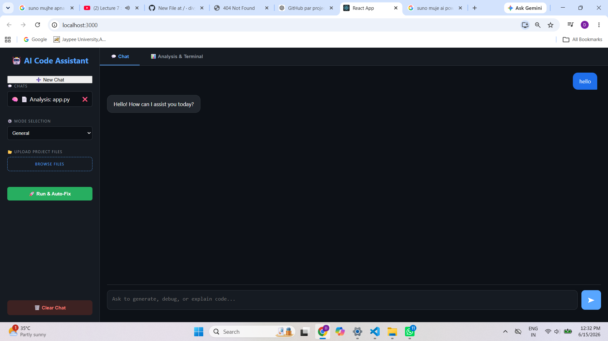
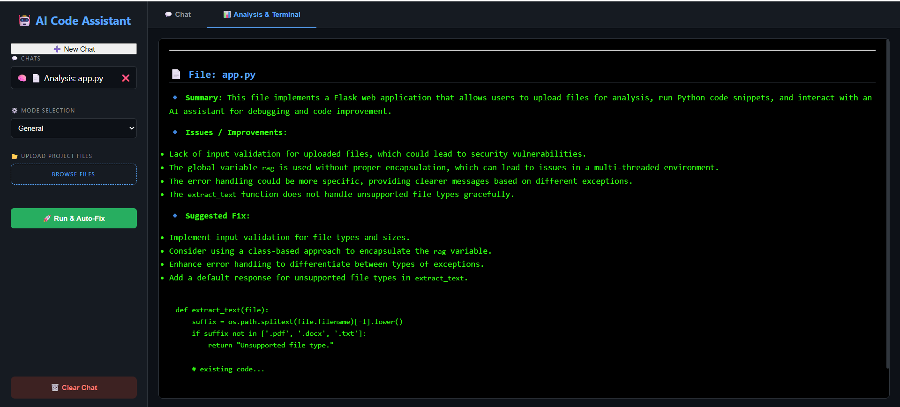

# 🤖 AI Powered Code Assistant

An AI-powered full-stack Code Assistant that helps developers write, debug, analyze, and understand code using Large Language Models (LLMs), RAG, and sandbox execution.

##  Live Demo


https://ai-code-assistant-frontend-rosy.vercel.app/


---

##  Overview

AI Powered Code Assistant is a full-stack web application designed to assist developers with common coding tasks.

The application provides an interactive AI chat interface along with code analysis, debugging, file analysis, RAG-based question answering, Python code execution, and multi-chat history.

---

##  Features

* 💬 **AI Chat Assistant** — Ask coding-related questions and get AI-generated responses.
* 🧑‍💻 **Code Generation** — Generate code based on natural-language prompts.
* 🐞 **Code Debugging** — Identify errors and receive suggested fixes.
* 📖 **Code Explanation** — Understand complex code using simple explanations.
* 📄 **File Analysis** — Upload and analyze PDF, DOCX, and source-code files.
* 🔎 **RAG-Based Analysis** — Retrieves relevant information from uploaded documents for contextual responses.
* 💻 **Python Code Execution** — Run Python snippets through a controlled sandbox environment.
* 💬 **Multi-Chat System** — Create and maintain multiple conversations.
* 🕘 **Chat History** — Previous conversations are stored and can be reopened.
* 📊 **Code Analysis Reports** — Analyze uploaded files and receive structured feedback and improvement suggestions.

---

##  Tech Stack

### Frontend

* React.js
* JavaScript (ES6+)
* HTML5
* CSS3

### Backend

* Python
* Flask
* SQLite
* REST APIs

### AI / LLM

* LangChain
* OpenRouter
* Large Language Models (LLMs)

### RAG / Vector Database

* ChromaDB
* Retrieval-Augmented Generation (RAG)

### Other Libraries

* PyPDF
* docx2txt
* python-dotenv
* Requests

---

##  Project Architecture

```text
User
  │
  ▼
React Frontend
  │
  │ REST API
  ▼
Flask Backend
  │
  ├── AI / LLM
  │     └── LangChain + OpenRouter
  │
  ├── RAG Engine
  │     └── ChromaDB
  │
  ├── Code Sandbox
  │     └── Python Execution
  │
  └── Chat Database
        └── SQLite
```

---

##  Project Structure

```text
AI-Assistant-Pro/
│
├── backend/
│   ├── app.py
│   ├── langchain_client.py
│   ├── rag_engine.py
│   ├── sandbox.py
│   ├── db.py
│   └── requirements.txt
│
├── frontend/
│   ├── src/
│   ├── public/
│   └── package.json
│
├── chat_interface.png
├── analysis.png
└── README.md
```

---

##  Environment Variables

Create a `.env` file inside the `backend/` directory.

```env
OPENROUTER_API_KEY=your_api_key_here
```

Never commit your `.env` file or API keys to GitHub.

---

## 🚀 How to Run Locally

### 1. Clone the Repository

```bash
git clone https://github.com/divy686/ai-code-assistant.git
cd ai-code-assistant
```

### 2. Backend Setup

```bash
cd backend
pip install -r requirements.txt
python app.py
```

The Flask backend runs on:

```text
http://127.0.0.1:8080
```

### 3. Frontend Setup

Open a new terminal:

```bash
cd frontend
npm install
npm start
```

The React application runs on:

```text
http://localhost:3000
```

---

##  Screenshots

###  Chat Interface



### 📄 Code / File Analysis



---

##  Deployment

The application is deployed using:

* **Frontend:** Vercel
* **Backend:** Render

The React frontend communicates with the Flask backend through REST API endpoints.

---

##  Repository

**GitHub:**
https://github.com/divy686/ai-code-assistant

---

##  Author

**Divya Rana**

B.Tech Computer Science & Engineering

GitHub:
https://github.com/divy686
